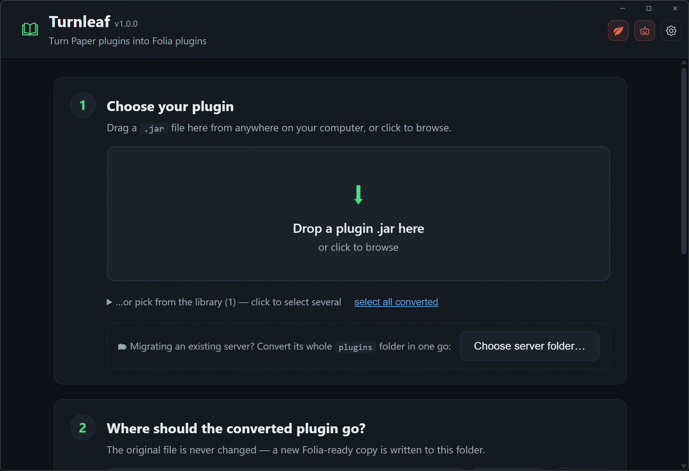

<h1 align="center">
  <br>
  Turnleaf
</h1>

<p align="center"><b>Turn your Paper plugins into Folia plugins — no source code needed.</b></p>

<p align="center">
  <a href="https://turnleafmc.io"></a>
  &nbsp;
  <a href="../../releases/latest"></a>
  &nbsp;
  <a href="LICENSE"></a>
</p>

You drop in a plugin `.jar`, you get back a Folia-ready `.jar`. That's it.



---

**[→ Plugin compatibility list](COMPATIBILITY.md)** — what's been converted and boot-verified on real Folia.

## The problem this solves

[Folia](https://github.com/PaperMC/Folia) is a fork of Paper that splits your world into regions and ticks each one on its own thread. That makes big servers much faster — but it breaks almost every existing plugin:

- The normal Bukkit scheduler doesn't exist on Folia. Any plugin that uses it crashes on startup.
- Touching an entity or block from the wrong thread crashes the server mid-game.

Fixing a plugin by hand means rewriting all of its scheduling code — and you usually don't even have the source code. This tool does the rewrite automatically, directly on the compiled `.jar`.

## How to get it

### Option 1 — Desktop app (easiest)

Download the installer from [Releases](../../releases), run it, done. It's a small window where you drag a `.jar` in, press **Convert**, and watch it work.

Installers are built automatically from this repository's source by GitHub Actions — every release links to the exact build run, so you can verify what you're running.

> **"Windows protected your PC"?** The installer isn't code-signed (certificates cost hundreds of dollars a year — not happening for a free tool). Click **More info → Run anyway**. If that makes you uncomfortable — fair! — use Option 2 below and run it from source, or build the installer yourself with Option 3; it's the same code either way.

The app needs two things installed on your PC (both free, you likely have them already):

| You need | Why | Get it |
|---|---|---|
| **Node.js 20+** | runs the converter | [nodejs.org](https://nodejs.org) |
| **Java 21+** | reads and rewrites the jar | [adoptium.net](https://adoptium.net) |

### Option 2 — Run from source (if you don't trust exes — fair!)

Everything the app does, you can do from a terminal. You need **Node.js 20+**, **Java (JDK) 21+**, and **Maven**:

```sh
git clone https://github.com/EmanuelNorsk/turnleaf
cd turnleaf
npm install                    # installs the TypeScript side
node scripts/fetch-tools.mjs   # downloads the decompiler + compile classpath (one time)
mvn package                    # builds the Java engine (one time)
```

Then either open the same dashboard the app uses, in your browser:

```sh
npm run cli -- gui
```

…or use the command line directly:

```sh
npm run cli -- convert MyPlugin.jar        # → out/MyPlugin-folia.jar
```

### Option 3 — Build the desktop app yourself

The app is just a small Rust (Tauri) window around the local server from Option 2. With [Rust](https://rustup.rs) installed:

```sh
npm run app:build      # → src-tauri/target/release/bundle/nsis/*-setup.exe
```

You can read exactly what the installer contains: `scripts/stage.mjs` assembles it, and it's the same files you built in Option 2.

## What it actually does to your plugin

The converter never decompiles or recompiles your plugin — it edits the compiled code directly. That's why the output **always loads**: there is no compile step that could fail.

**Step 1 — Scan.** It reads every class in the jar and finds every call that would break on Folia. The list of "dangerous" calls isn't guesswork: it's extracted from Folia's own server code (currently 1,162 API methods that Folia region-locks).

**Step 2 — Rewrite.** Each dangerous call is redirected to a small safety layer that gets injected into your jar. At runtime, that layer checks: *"is this code already running on the right thread?"*

- Yes → run it directly, basically zero overhead.
- No → hand it to the thread that owns that part of the world, the way Folia wants.

Scheduler calls (`BukkitScheduler`, `BukkitRunnable`, …) get the same treatment via [FoliaLib](https://github.com/TechnicallyCoded/FoliaLib), and `folia-supported: true` is added so Folia will load the plugin at all.

**Step 3 — Make shared data thread-safe.** Folia runs your plugin's code on many threads at once, so a plain `HashMap` that used to be fine can now corrupt itself. The converter traces which data is touched from multiple threads and swaps in thread-safe versions — but only where it can prove the swap is safe. Anything it can't prove is listed in the report instead of silently changed.

**Step 4 — Double-check.** The finished jar is scanned again, exactly like in step 1. The report tells you how many problems remain — for the plugins we test with, it's 0.

**Optional — AI pass.** A few rare patterns can't be fixed mechanically. For those, the tool can decompile just the affected classes, ask an AI for a minimal fix, and only accept it after the code compiles and re-verifies. The result is saved as a separate `-t3.jar` so it never contaminates your normal converted jar. Bring your own API key — DeepSeek, OpenAI, Anthropic (Claude), Cerebras, or any OpenAI-compatible endpoint; the app auto-detects the provider from the key where possible. An **AI strength** setting (Quick / Standard / Deep) controls how many cases it attempts and how ambitious the fixes are — Deep may restructure code properly for Folia instead of minimal patches, at higher API usage.

**Optional — AI self-repair.** If a converted plugin crashes on your server, paste the crash log into **AI Repair** (or let the tool boot the plugin locally to find crashes itself). It locates your plugin's classes in the stack trace, decompiles only those, has the AI fix the crash behind the same compile gate, and — in boot mode — re-boots and repeats until clean. The repaired jar is saved separately; your original is untouched.

## Migrating a whole server

Point the app (or `cli migrate <serverDir>`) at an existing server and it handles the plugins folder as a set: plugins that already support Folia are left alone, everything else is converted **in place with the same filenames** (so configs and update scripts keep working), and the originals are backed up to `plugins/pre-folia-backup/`. Safe to re-run any time — it skips what's already done.

Every converted jar records which converter version produced it. When you update this tool, outdated conversions are flagged in the app with a one-click **re-convert**, and `migrate` refreshes them automatically from the backed-up originals.

## Watching a live server

Point **Watch a live server** at a running server's `logs/latest.log`: new errors are analyzed the moment they happen — attributed to the plugin jar that threw them, tagged with what kind of failure it is (wrong-thread access, missing dependency, data race, …), and one click sends the trace to AI Repair with the right jar pre-selected.

**Optional — Boot test.** If you put a Folia server jar in the `folia/` folder, the tool can start a real Folia server with your converted plugin, read the log, and give you a clear PASS or FAIL.

## Command reference

```sh
npm run cli -- gui                    # the dashboard (what the desktop app shows)
npm run cli -- scan    MyPlugin.jar   # just report problems, change nothing
npm run cli -- convert MyPlugin.jar   # the main event → out/MyPlugin-folia.jar
npm run cli -- batch   plugins/       # convert a whole folder
npm run cli -- analyze MyPlugin.jar   # detailed thread-safety report
npm run cli -- verify  out/MyPlugin-folia.jar   # boot it on a real Folia server
npm run cli -- ai      MyPlugin.jar   # AI pass (configure a key in the app, or DEEPSEEK_API_KEY in .env.local)
npm run cli -- repair  out/MyPlugin-folia.jar --log crash.log   # AI-fix a crash from your server
npm run cli -- repair  out/MyPlugin-folia.jar --boot            # find crashes by booting locally, fix, re-verify
npm run cli -- migrate C:\my-server        # convert a whole server's plugins folder in place
```

## Good to know

- **Test before production.** A converted plugin loading cleanly is guaranteed; every gameplay feature behaving identically under multithreading is something only your test server can confirm. The reports tell you exactly where to look.
- **Your gameplay logic is not touched.** The converter redirects *scheduling and threading* calls. It does not "optimize", reorder, or reinterpret what your plugin does.
- **Converted jars are stamped.** Each one carries a `folia-on-demand.properties` file recording what was changed, so a converted build can never be mistaken for the original.
- **Respect plugin licenses.** Convert plugins for your own server. Don't redistribute converted jars of plugins you don't own.

## For contributors

| Path | What lives there |
|---|---|
| `src/` | TypeScript — CLI, GUI, conversion pipeline, analyzer, AI pass |
| `src/rules/` | what counts as "dangerous": hand-written rules + the catalog mined from Folia |
| `engine/` | Java — reads/rewrites jar bytecode (ASM), runs as a background daemon |
| `shim-runtime/` | Java — the safety layer that gets injected into converted plugins |
| `src-tauri/` | Rust — the desktop window |
| `scripts/` | packaging: single-file bundle + self-contained app staging |
| `tests/` | plugin corpus + probe plugin used for regression tests |

How it all works under the hood: [PLAN.md](PLAN.md).

## License

[GPL-3.0](LICENSE) — free to use, study, and modify; forks and derivatives must stay open source under the same license.
